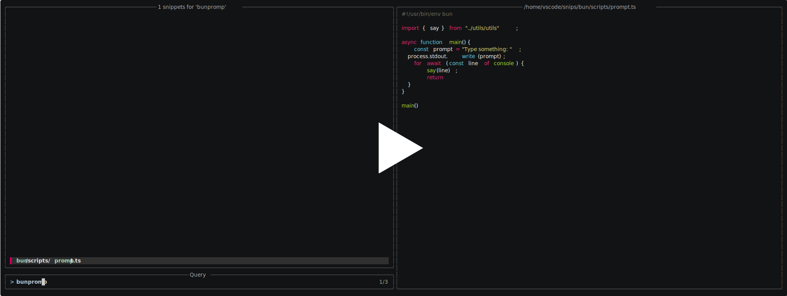

# snips

A simple CLI to help with snippets and scripts.

[](https://asciinema.org/a/G8Ehjhjo4dICxlYe)

## Installation

Download the standalone binary from the [releases](https://github.com/JanMalch/snips/releases) page,
and put it somewhere it can be picked up as a global CLI.

## Configuration

snips requires a `config.yaml` to define one or more sources for your snippets.
You can set the location with the `SNIPS_CONFIG` environment variable.
If not set, it will look in the default [user config dir](https://pkg.go.dev/os#UserConfigDir) of your platform,
e.g. `$XDG_CONFIG_HOME/snips/config.yaml`.

You must define one or more sources, which are directories holding your snippets.
These will be searched when running the snips CLI.

```yaml
sources:
  - ./relative/
  - /absolute/
  - ~/snippets/
# Include the name of the directory, when multiple sources are being used. Defaults to true.
include_source_name: true
```

> `~` will be replaced with the [user home dir](https://pkg.go.dev/os#UserHomeDir) of your platform.

### Runners

Runners allow you to define custom commands based on the file extensions of your snippets.
Out of the box, snips doesn't define any and only parses shebangs.
**snips will not check for availability of the runners.**

> snips will always show runners based on a shebang at the top.

Here is an example configuration to get you started.
Add this to your `config.yaml`, right next to your `sources`.
Make sure you pick the runners you like and actually have installed. 

```yaml
runners:
  - ext: ".sh"
    name: "sh"
  - exts: [".js", ".cjs", ".mjs", ".ts"]
    name: node
  - exts: [".js", ".cjs", ".mjs", ".ts"]
    name: bun
  - exts: [".js", ".cjs", ".mjs", ".ts"]
    name: deno
  - ext: py
    name: python
  - ext: lua
    name: lua
  - ext: go
    name: go
    args: ["run", "{}"]
  - ext: kts
    name: kotlinc
    args: ["-script"]
```

The leading dot for file extensions in `ext` and `exts` are optional.
You can repeat extensions multiple times to define multiple runners.

The `{}` in the `args` refer to the absolute file path of the selected snippet.
When the placeholder is omitted, it will be added as the last argument.
The `args` property is optional and will default to `["{}"]`.

### fzf

snips uses the awesome [`fzf`](https://github.com/junegunn/fzf) fuzzy finder.
Note that you don't need it installed, since snips uses it as a Go library directly.
You have some options to configure fzf, all of which are optional.

```yaml
sources: # omitted for brevity
runners: # omitted for brevity

# Based on https://github.com/junegunn/fzf
# Displayed values are defaults.
fzf:
  # Whether to load fzf defaults ($FZF_DEFAULT_OPTS_FILE and $FZF_DEFAULT_OPTS).
  use_env: true
  # shell command to preview the file.
  # Make sure you use {1} to get the absolute file to the path.
  preview: "cat {1}"
  # shell command for the 'focus:transform-preview-label' bind.
  # Set to an empty string to disable.
  preview_label: "[[ -n {} ]] && printf \" %s \" {1}"
  # shell command for the 'result:transform-list-label' bind.
  # Set to an empty string to disable.
  list_label: |-
    if [[ -z $FZF_QUERY ]]; then
      echo " $FZF_MATCH_COUNT snippets "
    else
      echo " $FZF_MATCH_COUNT snippets for '$FZF_QUERY' "
    fi
```

Feel free to customize, e.g. with [`bat`](https://github.com/sharkdp/bat) for the preview via `bat --color=always --style=plain {1}`.

## Sources

Optionally, you can put a `snips.yaml` in each directory defined under [`sources`](#configuration).
It allows you to configure which files to actually consider as snippets and scripts.

```yaml
include:
  - "scripts/**/*.ts"
```

This way you can exclude utility files which are only used by the actual scripts.

> See the [`_example`](./_example/) directory for a working setup.

## Usage

When snips is invoked, the fuzzy finder displays all available snippets.
Select a snippet by pressing `Enter`. You can also set an initial query via an argument: `snips foo`.
When only one snippet matches, it is selected automatically.

When invoked without additional options, `snips` will simply print the selected file and exit.
Using the `--copy/-c` flag will copy the file content to your system clipboard.

When invoked with the `--exec/-x` flag, it will try to run the file instead.
`snips` displays one or more options on how to run the file, which you have to confirm manually.

Run `snips -h` for more details and complimentary actions.

> For ad-hoc usage, you can run `snips -w` to use the current working directory as a source.

### Help

```bash
$ snips --help
Usage: snips [<snippet>] [flags]

CLI to help with snippets and scripts.

Examples:

    snips foo           Searches a snippet by path, then prints the file's content.
    snips -c foo        Searches a snippet by path, then prints and copies the file's content.
    snips -x foo        Searches a snippet by path, then executes the selected command.       
    snips -xc foo       Searches a snippet by path, then copies the selected command.
    snips -xp foo       Searches a snippet by path, then prints the selected command.

Arguments:
  [<snippet>]    Optional initial query for the snippet path, or content when
                 using --grep/-g. The query is optional. When only one snippet
                 matches, it is selected automatically.

Flags:
  -h, --help             Show context-sensitive help.
  -x, --exec             Execute the selected snippet after confirmation.
                         Defaults to false.
  -c, --copy             Copies the selected snippet to the system clipboard. In
                         --exec mode it copies the command instead of executing
                         it. Defaults to false.
  -p, --[no-]print       Prints the selected snippet, and defaults to true. In
                         --exec mode, it prints the command instead of executing
                         it, and defaults to false.
  -l, --locate           Only print the full absolute path of the selected
                         snippet before exiting.
  -w, --here             Use the current working directory as the only source.
                         Defaults to false.
  -s, --source=SOURCE    Select a source by index from your global snips config
                         file. You can also use -0 to -9.
  -v, --version          Print version information and quit
      --updates          Checks for updates for the snips CLI. Same as --up.
```
